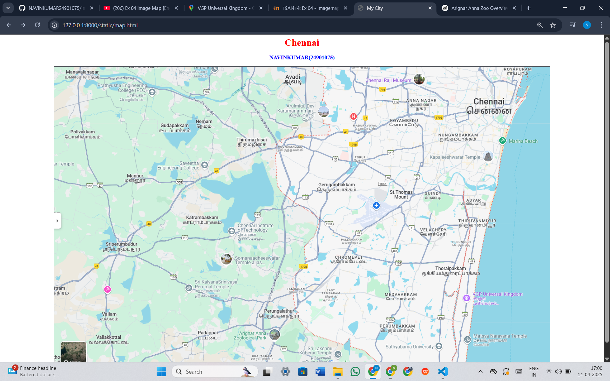
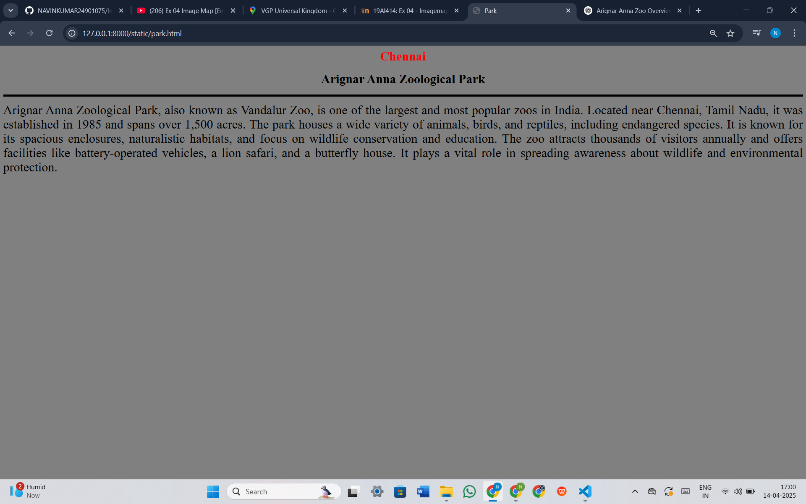
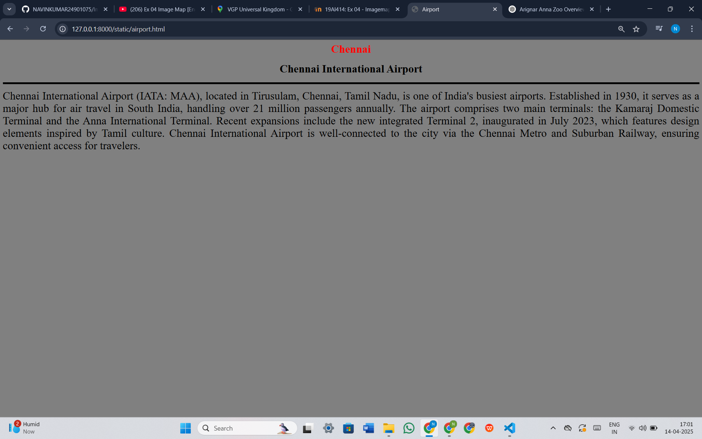
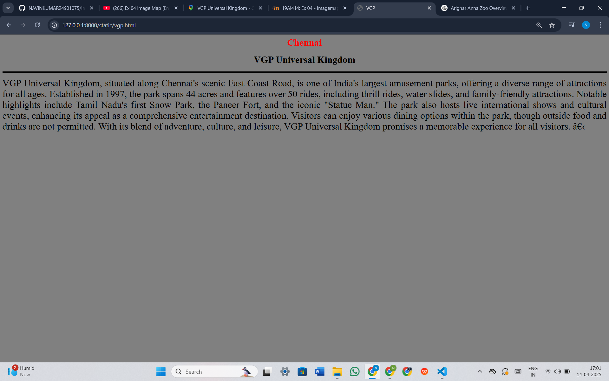
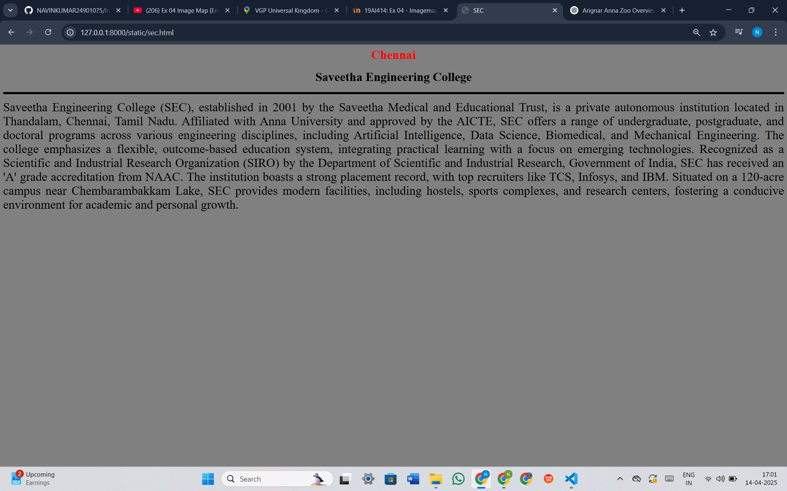
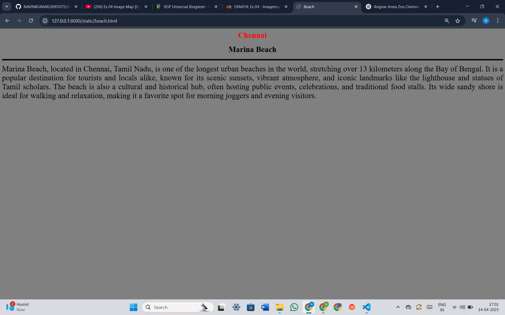
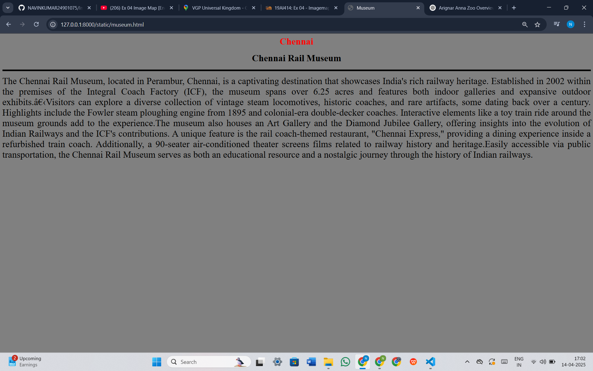

# Ex04 Places Around Me
# Date:12-04-2025
# AIM
To develop a website to display details about the places around my house.

# DESIGN STEPS
## STEP 1
Create a Django admin interface.

## STEP 2
Download your city map from Google.

## STEP 3
Using <map> tag name the map.

## STEP 4
Create clickable regions in the image using <area> tag.

## STEP 5
Write HTML programs for all the regions identified.

## STEP 6
Execute the programs and publish them.

# CODE
```
map.html

<html>
        <head>
            <title>My City</title>
            <style>
                .imagecenter{
                    display: block;
                    margin-left: auto;
                    margin-right: auto;
                }
            </style>
        </head>
        <body>
            <h1 align="center">
                <font color="red"><b>Chennai</b></font>
            </h1>
            <h3 align="center">
                <font color="blue"><b>NAVINKUMAR(24901075)</b></font>
            </h3>
            
            <map name="MyCity">
                <area target="" alt="" title="park" href="park.html" coords="584,907,820,887" shape="rect">
                <area target="" alt="" title="Airport" href="airport.html" coords="866,422,1047,550" shape="rect">
                <area target="" alt="" title="vgp" href="vgp.html" coords="1266,774,1368,810" shape="rect">
                <area target="" alt="" title="beach" href="beach.html" coords="1488,227,1341,255" shape="rect">
                <area target="" alt="" title="SEC" href="sec.html" coords="428,377,313,304" shape="rect">
                <area target="" alt="" title="museum" href="museum.html" coords="1038,5,1174,68" shape="rect">
            </map>

</head>    
</html>

park.html

<html>
    <head>
        <title>Park</title>
    </head>
    <body bgcolor="grey">

        <h1 align="center">
          <font color="red"><b>Chennai</b></font>
        </h1>
        <h1 align="center">
            <font color="black"><b>Arignar Anna Zoological Park</b></font>
        </h1>
        <hr size="5" color="black">
        <p align="justify">
        <font face="" size="6">
            Arignar Anna Zoological Park, also known as Vandalur Zoo, is one of the largest and most popular zoos in India. Located near Chennai, Tamil Nadu, it was established in 1985 and spans over 1,500 acres. The park houses a wide variety of animals, birds, and reptiles, including endangered species. It is known for its spacious enclosures, naturalistic habitats, and focus on wildlife conservation and education. The zoo attracts thousands of visitors annually and offers facilities like battery-operated vehicles, a lion safari, and a butterfly house. It plays a vital role in spreading awareness about wildlife and environmental protection.
        </font>
        </p>
     </body>
 </html>

airport.html

<html>
    <head>
        <title>Airport</title>
    </head>
    <body bgcolor="grey">

        <h1 align="center">
          <font color="red"><b>Chennai</b></font>
        </h1>
        <h1 align="center">
            <font color="black">Chennai International Airport<b></b></font>
        </h1>
        <hr size="5" color="black">
        <p align="justify">
        <font face="" size="6">
            Chennai International Airport (IATA: MAA), located in Tirusulam, Chennai, Tamil Nadu, is one of India's busiest airports. Established in 1930, it serves as a major hub for air travel in South India, handling over 21 million passengers annually. The airport comprises two main terminals: the Kamaraj Domestic Terminal and the Anna International Terminal. Recent expansions include the new integrated Terminal 2, inaugurated in July 2023, which features design elements inspired by Tamil culture. Chennai International Airport is well-connected to the city via the Chennai Metro and Suburban Railway, ensuring convenient access for travelers.
        </font>
        </p>
     </body>
 </html>

vgp.html

<html>
    <head>
        <title>VGP</title>
    </head>
    <body bgcolor="grey">

        <h1 align="center">
          <font color="red"><b>Chennai</b></font>
        </h1>
        <h1 align="center">
            <font color="black"><b>VGP Universal Kingdom</b></font>
        </h1>
        <hr size="5" color="black">
        <p align="justify">
        <font face="" size="6">
            VGP Universal Kingdom, situated along Chennai's scenic East Coast Road, is one of India's largest amusement parks, offering a diverse range of attractions for all ages. Established in 1997, the park spans 44 acres and features over 50 rides, including thrill rides, water slides, and family-friendly attractions. Notable highlights include Tamil Nadu's first Snow Park, the Paneer Fort, and the iconic "Statue Man." The park also hosts live international shows and cultural events, enhancing its appeal as a comprehensive entertainment destination. Visitors can enjoy various dining options within the park, though outside food and drinks are not permitted. With its blend of adventure, culture, and leisure, VGP Universal Kingdom promises a memorable experience for all visitors. ​
        </font>
        </p>
     </body>
 </html>

sec.html

<html>
    <head>
        <title>SEC</title>
    </head>
    <body bgcolor="grey">

        <h1 align="center">
          <font color="red"><b>Chennai</b></font>
        </h1>
        <h1 align="center">
            <font color="black">Saveetha Engineering College<b></b></font>
        </h1>
        <hr size="5" color="black">
        <p align="justify">
        <font face="" size="6">
            Saveetha Engineering College (SEC), established in 2001 by the Saveetha Medical and Educational Trust, is a private autonomous institution located in Thandalam, Chennai, Tamil Nadu. Affiliated with Anna University and approved by the AICTE, SEC offers a range of undergraduate, postgraduate, and doctoral programs across various engineering disciplines, including Artificial Intelligence, Data Science, Biomedical, and Mechanical Engineering. The college emphasizes a flexible, outcome-based education system, integrating practical learning with a focus on emerging technologies. Recognized as a Scientific and Industrial Research Organization (SIRO) by the Department of Scientific and Industrial Research, Government of India, SEC has received an 'A' grade accreditation from NAAC. The institution boasts a strong placement record, with top recruiters like TCS, Infosys, and IBM. Situated on a 120-acre campus near Chembarambakkam Lake, SEC provides modern facilities, including hostels, sports complexes, and research centers, fostering a conducive environment for academic and personal growth. 
        </font>
        </p>
     </body>
 </html>

beach.html

<html>
    <head>
        <title>Beach</title>
    </head>
    <body bgcolor="grey">

        <h1 align="center">
          <font color="red"><b>Chennai</b></font>
        </h1>
        <h1 align="center">
            <font color="black"><b>Marina Beach</b></font>
        </h1>
        <hr size="5" color="black">
        <p align="justify">
        <font face="" size="6">
            Marina Beach, located in Chennai, Tamil Nadu, is one of the longest urban beaches in the world, stretching over 13 kilometers along the Bay of Bengal. It is a popular destination for tourists and locals alike, known for its scenic sunsets, vibrant atmosphere, and iconic landmarks like the lighthouse and statues of Tamil scholars. The beach is also a cultural and historical hub, often hosting public events, celebrations, and traditional food stalls. Its wide sandy shore is ideal for walking and relaxation, making it a favorite spot for morning joggers and evening visitors.
        </font>
        </p>
     </body>
 </html>

museum.html

<html>
    <head>
        <title>Museum</title>
    </head>
    <body bgcolor="grey">

        <h1 align="center">
          <font color="red"><b>Chennai</b></font>
        </h1>
        <h1 align="center">
            <font color="black">Chennai Rail Museum<b></b></font>
        </h1>
        <hr size="5" color="black">
        <p align="justify">
        <font face="" size="6">
            The Chennai Rail Museum, located in Perambur, Chennai, is a captivating destination that showcases India's rich railway heritage. Established in 2002 within the premises of the Integral Coach Factory (ICF), the museum spans over 6.25 acres and features both indoor galleries and expansive outdoor exhibits.​Visitors can explore a diverse collection of vintage steam locomotives, historic coaches, and rare artifacts, some dating back over a century. Highlights include the Fowler steam ploughing engine from 1895 and colonial-era double-decker coaches. Interactive elements like a toy train ride around the museum grounds add to the experience.The museum also houses an Art Gallery and the Diamond Jubilee Gallery, offering insights into the evolution of Indian Railways and the ICF's contributions. A unique feature is the rail coach-themed restaurant, "Chennai Express," providing a dining experience inside a refurbished train coach. Additionally, a 90-seater air-conditioned theater screens films related to railway history and heritage.Easily accessible via public transportation, the Chennai Rail Museum serves as both an educational resource and a nostalgic journey through the history of Indian railways.
        </font>
        </p>
     </body>
 </html>
```
# OUTPUT







# RESULT
The program for implementing image maps using HTML is executed successfully.
